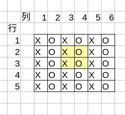
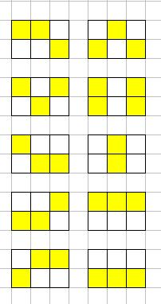

# 停电

#### 题目描述

西京市的每一户家庭都住在一个大小为$1*1$（一行一列，也就是一个格子）的正方形的地块里。这里有很多个正方形的地块，构成了一个 $n$ 行 $m$ 列长方形的大地块。

由于「煤炭」高飞到 1500 元，西京市快没电了，为了实行限电，「哈格」市长决定断掉一部分家庭的电。

善良温和的一般居民们对此提出的条件是:对于任何一个$2*2$的地块的四户人家里，至少两户人家供电。
但是剩余的电力只能满足，对于任何一个$2*2$的地块的四户人家里，最多给两户人家供电。

为了同时满足这两个条件，good市长必须做到

**对于任何一个 $2*2$ 的地块里，有且仅有两户人家供电。**

「哈格」市长想问问你，有多少种供电方案才能让大家满意呢？

譬如下图是对5行6列的大地块的一种解决方案，X代表地块供电。O代表地块不供电



可以看见，对于大地块内的任意一个$2*2$的地块（比如淡黄色高亮的那个地块），都有两户亮着灯。


#### 输入描述
输入只有一行

第一行有两个数字： n，m。代表n行，m列。
$2<=n<=10^7,2<=m<=10^7$

#### 输出描述
输出只有一个数字。也就是一共有多少种供电方法。由于答案可能会很大，输出时请对998244353取模。

**tips:什么是取模？**

如果你是大一新生，不知道取模是什么也情有可原, a%b ,也就是 a 对 b 取模。就是求两个数相除的余数。

例：17 对 6 取模是多少？，求 17 % 6, 因为 17 / 6 = 2 余数为 5。 17 对 6 取模就是 5。 17%6=5

在c,c++,java,python等语言中，取模的运算符是 “%”
``` c++
int a,b;
a=17; b=6;
c = a%b; // 此时c = 5
```

同时,你可能会需要公式：
$(a+b) \%x = a\%x + b\%x$

$(a*b)\%x = a\%x * b\%x$

#### 样例数据

##### 样例1：
input:
```
2 2
```
output:
```
6
```

##### 样例2：
input:
```
2 3
```
output:
```
10
```

#### 样例解释和范围：
对于样例3，有如下的10种供电方法，每一种都保证了n*m的大地块中，任意一个2*2的：



对于10%的数据：
$2<=n<=5,2<=m<=5$

对于20%的数据：
$2<=n<=10,2<=m<=10$

对于30%的数据：
$2<=n<=50,2<=m<=50$

对于40%的数据：
$2<=n<=100,2<=m<=100$

对于60%的数据：
$2<=n<=10000,2<=m<=10000$

对于100%的数据：
$2<=n<=10^7,2<=m<=10^7$
